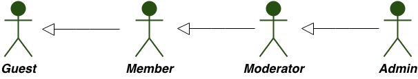

AchieveMe Specification
===============

Description
-------------
Web app for a community / organization / group of people, for registering members achievments.

User types:
---------------------------
	- Guest: can register, read some static pages and visualize member's achievments and profile
	- Member: same as guest + can edit his profile, make a submit for an achievement.
	- Moderator: same as member + can validate, add and modify achievement. He cannot validate, modify or add his own achievements.
	- Admin: same as member + can change users status.

Achievements:
---------------------------
	Are available the same for everybody and are categorized.
	An achievement is represented by: image, title, description, date of realization, user who approved/addeds the achievement, date of approval.
	Each achievement will have 0-5 points (0 - it's a symbolic achievement).
	There are special achievements (category "special" or "bonus"), which are not computed in Σ(sum_of_all_points), but are counted in total points a member achieved.

Ratio:
---------------------------
	Ratio for each member is computed by formula:
	<total_points_achieved> / Σ(sum_of_all_points).
	Ratio will be represented as a bar with 5 sections and the top members will be represented in a list with picture + ration + last achievement.

Technologies:
----------------------------------
	1. For back-end will be used node.js (or a framework based on)
	2. For front-end: bootstrap
	3. Login/Sign in will be implemented by use of google authorization
	4. *For later there will be a cache for achievements and ratio.

Site structure:
----------------
1. For Guests:
	- What is AchieveMe?
	- Top members
	- [static pages]
2. For Members (same as for Guests +):
	- Profile
	- My achievements
	- Submit new achievment
3. For Moderators (same as for Members +):
	- Answer a submit
	- Add/modify/delete an achievement of a member
4. For Admins (same as for Moderators +):
	- Users list
	- Achievements list